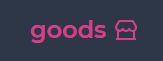
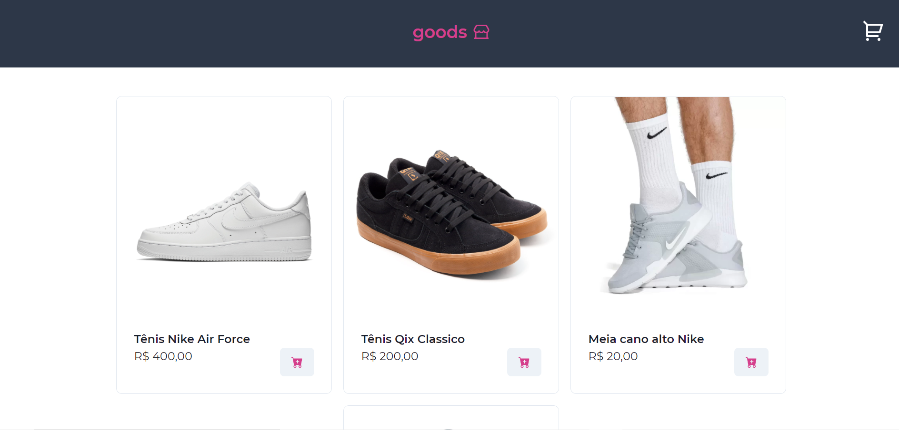
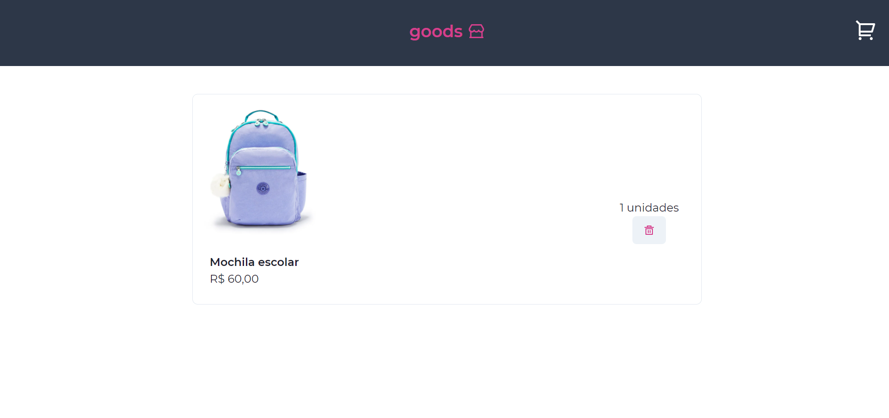
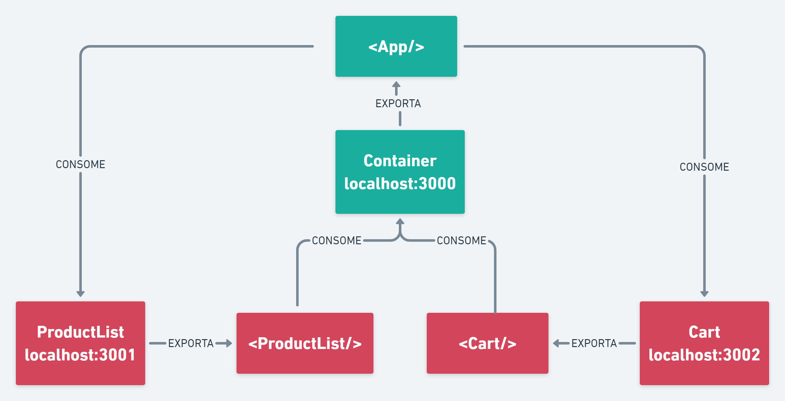

<h1 align="center" style="color: #805ad5; font-weight: bold;">
  
</h1>

<p align="center">
 <a href="#tech">Technolgies</a> • 
 <a href="#clone">Clone</a> • 
 <a href="#contribute">Contribute</a> •
 <a href="#license">License</a>
</p>

<p align="center">
<b>This application is a e-commerce prototype, this e-commerce is divided in 3 federated modules Container (shell of the application), ProductList (component responsible for fetching and listing all products) and Cart (responsible for list all products that user saved on his cart or remove it)</b>
</p>

<p align="center">
  
  
</p>


<h2 id="tech">Technologies</h2>
  This application architecture is organized in bidirectional modules:

  - Container (Shell of the app), exports 'App' where all modules are combined to form the application - running in port 3000
  - ProductList (List of all products), export 'ProductList' and consumes 'App' from Container - running in port 3001
  - Cart (Shopping Cart), export 'Cart' and consumes 'App' from Container - running in port 3002

  ### More
  The same application will be seen on all ports, but, each one loads the modules that is consuming on RUNTIME, meaning that the bundle of each app will be different containing only the code that belongs to he and will not include the remotes modules its consumes.
  The modules share their dependencies as well to avoid duplicate dependencies load

  <p align="center">
    
  </p>

<h2 id="clone">Clone</h2>

<h4> Prerequisites</h4>

- Node >= 10.16 e npm >= 5.6 
- Package manager - NPM or YARN

<h4>Starting</h4>

```
git clone https://github.com/Fernanda-Kipper/module-federarion.git
npm install
```

<h5>Start server that list products</h5>

```
  cd ProductList
  npm run server
```

<h5>Start Clients</h5>

```
  cd Container
  npm run dev
```

```
  cd ProductList
  npm run dev
```

```
  cd Cart
  npm run dev
```

<h2 id="contribute">Contribute 🚀</h2>

If you want to contribute, clone this repo, create your work branch and get your hands dirty!

```bash
git clone https://github.com/Fernanda-Kipper/video-chat.git
git checkout -b feature/NAME
```

 At the end, open a Pull Request explaining the problem solved or feature made, if exists, append screenshot of visual modifications and wait for the review!

[How to create a Pull Request](https://www.atlassian.com/br/git/tutorials/making-a-pull-request)

[Commit pattern](https://gist.github.com/joshbuchea/6f47e86d2510bce28f8e7f42ae84c716)


<h2 id="license">License 📃 </h2>

This project is under [MIT](LICENSE) license


